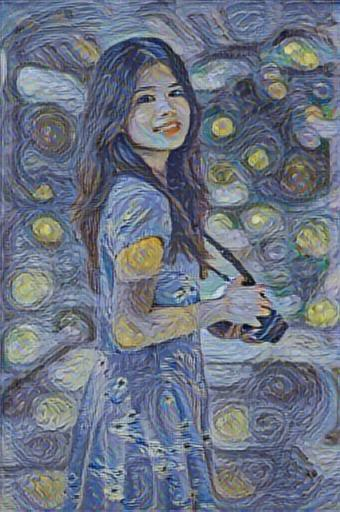

# Neural Style Transfer with TensorFlow Hub

This project applies neural style transfer to blend the content of one image with the style of another using a pre-trained model from [TensorFlow Hub](https://tfhub.dev). The model applies artistic styles from one image onto the structure of another, creating a unique, stylized output.



## Features

- **Pre-trained Style Transfer**: Uses the [Magenta Arbitrary Image Stylization model](https://tfhub.dev/google/magenta/arbitrary-image-stylization-v1-256/2) from TensorFlow Hub.
- **Easy Customization**: Modify images, resolution, or other parameters with minimal code changes.
- **Efficient Processing**: Includes optimizations for efficient image loading and resizing.

## Requirements

- Python 3.7+
- TensorFlow 2.x
- TensorFlow Hub
- NumPy
- Pillow (PIL)

## Installation

1. **Clone the Repository**:
    ```bash
    git clone https://github.com/Fakhrillo/TensorFlow-Image-Stylizer.git
    cd TensorFlow-Image-Stylizer
    ```

2. **Install Dependencies**:
    ```bash
    pip install -r requirements.txt
    ```

   Ensure the following dependencies are listed in `requirements.txt`:
   ```plaintext
   tensorflow
   tensorflow_hub
   numpy
   pillow
   ```

## Usage
1. **Run the Script**:
    ```bash
    python main.py
    ```

2. **View the Output**: 
    The script will display the stylized image. Modify ```tensor_to_image(hub_model(content_image, style_image)[0]).show()``` in style_transfer.py if you want to save the output instead:
    ```bash
    tensor_to_image(hub_model(content_image, style_image)[0]).save("output.jpg")
    ```

## References
[TensorFlow Hub: Arbitrary Image Stylization](https://www.kaggle.com/models/google/arbitrary-image-stylization-v1/tensorFlow1/256/2?tfhub-redirect=true)
[Magenta Project](https://www.tensorflow.org/tutorials/generative/style_transfer)


## License
This project is licensed under the MIT License.